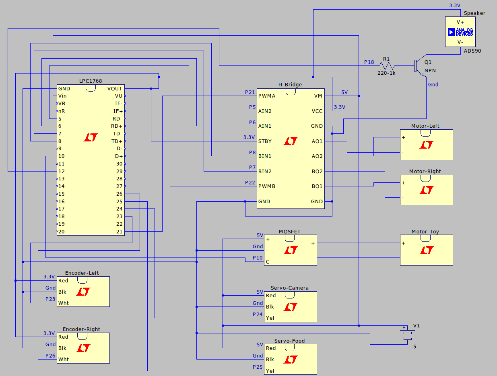

# ECE4180 DESIGN PROJECT - CATBOT

## Developers

* Zara Dash
* Srihari Subramanian
* Wesley Sweeney
* Yvan Tamba

## Introduction

The CatBot is a home robot designed for pets, with the ability to dispense treats and play with the pet. The best part? It can be controlled with an user interface from anywhere in the world. The CatBot uses Raspberry Pi 4 to interface over the web, and sends all of the control signals to the Mbed. 

This final project was created by students from the Georgia Institute of Technology for ECE 4180: Embedded Systems Design.

## Getting Started

### Setup Instructions

```
cd CatBot
mkdir build
cd build
cmake ..
make clean
make
./catbot-app
```

You might have to install libraries such as raspicam and GTK+-3.0

### Parts List

* Mbed - LPC1768		

* Servo - Hitec HS-422 	

* SparkFun Motor Driver - Dual TB6612FNG (with headers)

* DC Barrel Jack Adapter - Breadboard Compatible		

* Hobby Gearmotor - 140 RPM (Pair)				

* Sparkfun Shadow Chassis					

* Wheel - 65mm (Rubber Tire, Pair)				

* Portable Pillow Speaker with 3.5mm Aux Plug		

* Gikfun 1.5V-6V Type 130 DC Motor				

* SparkFun MOSFET Power Control Kit			

* Raspberry Pi 4, 4GB							

* 8 - 16G SD card						

* 5V DC Power Supply					

* Battery Holder - 4xAA to Barrel Jack 			

* Plastic Coffee can						

* Plastic peanuts container					

* Raspberry Pi Camera						

* Raspberry Pi Camera 9inch ribbon cable			 

* Animal food bowl							

* USB Audio Speaker	


### Hardware Wiring 




